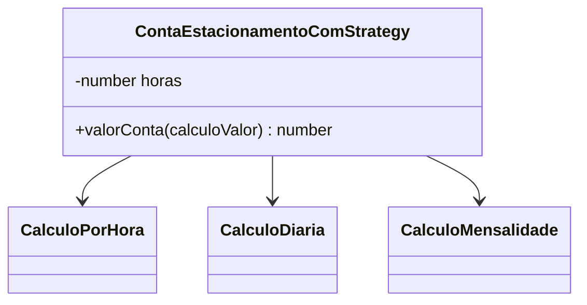

# Trabalho - Engenharia de Software II

## Padrao de desenvolvimento escolhido

**Strategy** - padrao comportamental do GoF.

## Objetivo

Este trabalho apresenta o padrao de projeto **Strategy**, explicando o problema que ele resolve, sua estrutura, seus pontos fortes e fracos, alem de exemplos em **JavaScript** com uma solucao sem o padrao e outra usando o padrao.

O exemplo utilizado e um sistema de estacionamento que calcula o valor de uma conta de acordo com a regra de cobranca escolhida.

## Problema

Um estacionamento pode cobrar valores de formas diferentes:

- Cobranca por hora.
- Cobranca por diaria.
- Cobranca por mensalidade.

Uma primeira solucao comum seria colocar todas essas regras dentro da mesma classe, usando varios `if`, `else` ou `switch`.

Isso funciona no inicio, mas gera problemas quando novas regras aparecem. A classe cresce, fica mais dificil de entender, mais dificil de testar e mais arriscada de alterar.

## Solucao sem o padrao

Na versao sem Strategy, a classe `ContaEstacionamentoSemStrategy` concentra todas as regras de calculo.

Arquivo principal:

`src/sem_padrao/contaEstacionamentoSemStrategy.js`

Trecho principal:

```javascript
switch (tipoCobranca) {
  case TipoCobranca.HORA:
    return 2.0 * Math.ceil(this.horas);
  case TipoCobranca.DIARIA:
    return 24.0 * Math.ceil(this.horas / 24.0);
  case TipoCobranca.MENSALIDADE:
    return 240.0 * Math.ceil(this.horas / 720.0);
  default:
    throw new Error("Tipo de cobranca invalido.");
}
```

### Problemas dessa abordagem

- A classe mistura a responsabilidade de representar a conta com a responsabilidade de calcular tarifas.
- Cada nova forma de cobranca exige alterar a classe existente.
- O codigo tende a crescer rapidamente.
- Fica mais dificil testar cada regra de calculo separadamente.
- A manutencao se torna mais arriscada, pois alterar uma regra pode afetar outras.

## Solucao com Strategy

Na versao com Strategy, cada regra de calculo e colocada em uma classe separada.

Arquivos principais:

- `src/com_padrao/contaEstacionamentoComStrategy.js`

Em JavaScript, a estrategia e representada por objetos que possuem o metodo `calcular`.

Contrato esperado:

```javascript
calculoValor.calcular(horas);
```

Cada estrategia implementa sua propria regra:

```javascript
class CalculoDiaria {
  constructor(valorDiaria) {
    this.valorDiaria = valorDiaria;
  }

  calcular(horas) {
    return this.valorDiaria * Math.ceil(horas / 24.0);
  }
}
```

A conta passa a receber uma estrategia:

```javascript
valorConta(calculoValor) {
  return calculoValor.calcular(this.horas);
}
```

## Estrutura do padrao



## Comparativo

| Criterio | Sem Strategy | Com Strategy |
|---|---|---|
| Organizacao | Regras concentradas em uma classe | Regras separadas por classes |
| Manutencao | Mais dificil com o crescimento | Mais simples e localizada |
| Extensibilidade | Exige alterar codigo existente | Permite adicionar novas estrategias |
| Testes | Testes ficam mais acoplados | Cada estrategia pode ser testada isoladamente |
| Complexidade inicial | Menor | Um pouco maior |

## Pontos fortes do Strategy

- Reduz condicionais grandes.
- Facilita a manutencao.
- Facilita a criacao de novas regras sem alterar a classe principal.
- Ajuda a aplicar o principio aberto/fechado: aberto para extensao e fechado para modificacao.
- Permite trocar o comportamento do objeto em tempo de execucao.

## Pontos fracos do Strategy

- Aumenta o numero de classes no projeto.
- Pode ser exagerado para regras muito simples e que nao devem mudar.
- O cliente precisa conhecer ou receber a estrategia correta.
- Pode deixar o projeto mais complexo se usado sem necessidade.

## Conclusao

O padrao Strategy e util quando existem varias formas de executar uma mesma acao e essas formas podem mudar ou crescer com o tempo.

No exemplo do estacionamento, ele melhora a organizacao do codigo porque separa cada regra de cobranca em uma estrategia propria. Assim, se o sistema precisar de uma nova tarifa, como cobranca por fim de semana ou por tipo de veiculo, e possivel criar uma nova classe sem modificar as regras ja existentes.

Apesar de aumentar a quantidade de classes, o ganho em clareza, manutencao e testabilidade compensa quando as regras de negocio tendem a evoluir.

## Como executar

Com Node.js instalado, rode os comandos abaixo na raiz do projeto.

Executar exemplo sem o padrao:

```powershell
node src/sem_padrao/contaEstacionamentoSemStrategy.js
```

Executar exemplo com Strategy:

```powershell
node src/com_padrao/contaEstacionamentoComStrategy.js
```

Nao e necessario compilar.

## Referencias

- Refactoring Guru. Strategy. https://refactoring.guru/pt-br/design-patterns/strategy
- Gamma, Erich; Helm, Richard; Johnson, Ralph; Vlissides, John. Design Patterns: Elements of Reusable Object-Oriented Software. 1994.
- Material da disciplina Engenharia de Software II - Padroes de Desenvolvimento.
